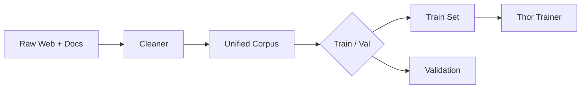

> Dive deep into the data pipeline, model architecture, and design decisions that power Atlas-AI.

## 1. Data Pipeline

- **Cleaner** – custom NLP stack removing PII & low-quality text.
- **Corpus** – 150 M multilingual sentences + 2 M image–text pairs.

## 2. Thor 1.1 Model

| Hyper-param | Value |
|-------------|-------|
| Layers | 20 |
| Hidden size | 1280 |
| Heads | 20 |
| Params | ~1.2 B |
| Context window | 2 k tokens |

### Innovations

1. **Hybrid contrastive objective** for image tokens.
2. **Mixture-of-Experts router** on top-k layers.
3. **Chunked rotary embeddings** to extend context.

## 3. Inference Stack

- **Flask** serving REST & websocket.
- **CUDA-kernel caching** for low-latency decoding.
- **Research Engine** – web search fallback with RAG.

## 4. Continuous Learning

Every 30 min:

1. Export new chats → TrainX compiler.
2. Fine-tune on incremental batches.
3. Evaluate on held-out QA & Gem prompts.
4. Roll-forward if BLEU/ROUGE ↑ and toxicity ↓.

## 5. Dev Experience

- One-command `dev_server.py` launches Hot Reload UI + API.
- GitHub Actions run pytest + eslint on every PR.
- Git LFS stores model checkpoints.

## 6. Future Work

- **Quantization aware training** for CPU edge deploy.
- **LoRA adapters** for user fine-tuning.
- **Federated learning** prototype.

_Read the code, run the demos, and open an issue with your ideas!_

