# Thor 1.2 Architecture: A Comprehensive Technical Guide

> **Document Version:** 1.0.0  
> **Last Updated:** January 2026  
> **Purpose:** Educational deep-dive into Thor 1.2's cognitive architecture, neural pathways, and response generation mechanisms

---

## Table of Contents

1. [Executive Summary](#1-executive-summary)
2. [High-Level Architecture Overview](#2-high-level-architecture-overview)
3. [The Neural Foundation: Qwen3-4B Base Model](#3-the-neural-foundation-qwen3-4b-base-model)
4. [Thor's Multi-Task Head System](#4-thors-multi-task-head-system)
5. [The Brain Knowledge System](#5-the-brain-knowledge-system)
6. [Query Processing Pipeline](#6-query-processing-pipeline)
7. [Response Generation Flow](#7-response-generation-flow)
8. [Continuous Learning System](#8-continuous-learning-system)
9. [Memory and Context Management](#9-memory-and-context-management)
10. [Error Handling and Fallback Mechanisms](#10-error-handling-and-fallback-mechanisms)
11. [Performance Optimization](#11-performance-optimization)
12. [Troubleshooting Guide](#12-troubleshooting-guide)
13. [Grand Schema: Complete System Diagram](#13-grand-schema-complete-system-diagram)

---

## Visual Overview

Before diving into the technical details, here are six visual figures that illustrate Thor 1.2's architecture:

### Figure 1: Thor 1.2 Brain Architecture Overview


*This figure shows the concentric layer architecture of Thor 1.2, with the Qwen3-4B core at the center, surrounded by task heads, knowledge systems, intelligence services, and the API gateway.*

### Figure 2: Transformer Architecture Detail


*This figure illustrates the internal transformer architecture showing the 36-layer stack with RMSNorm, Grouped Query Attention (32 heads), SwiGLU FFN, and residual connections.*

### Figure 3: Query Processing Flow


*This infographic shows the complete journey of a user query through Thor 1.2's processing pipeline, from input to final response.*

### Figure 4: Multi-Task Head System


*This diagram details the five specialized task heads that extend Qwen3-4B's capabilities, showing the data flow from hidden states through each head's architecture.*

### Figure 5: Brain Knowledge System


*This figure illustrates how the Brain Knowledge System stores, retrieves, and scores knowledge items to enhance Thor's responses with relevant context.*

### Figure 6: Continuous Learning Loop


*This diagram shows the automatic continuous learning cycle that allows Thor 1.2 to improve from user interactions every 30 minutes.*

---

## 1. Executive Summary

Thor 1.2 represents a sophisticated AI system built on top of the **Qwen3-4B** foundation model, enhanced with custom multi-task heads and a unique brain knowledge retrieval system. This document provides an exhaustive exploration of how Thor 1.2 "thinks" - from receiving a query to generating a contextually-aware response.

### Key Statistics

| Component | Specification |
|-----------|---------------|
| **Base Model** | Qwen3-4B (4 billion parameters) |
| **Task Heads** | ~1 billion additional parameters |
| **Total Parameters** | ~5 billion parameters |
| **Context Window** | 32,768 tokens (extendable to 131K with YaRN) |
| **Hidden Size** | 2,560 dimensions |
| **Transformer Layers** | 36 layers |
| **Attention Heads** | 32 (Grouped Query Attention) |
| **Vocabulary Size** | 151,936 tokens |

### Core Capabilities


---

## 2. High-Level Architecture Overview

Thor 1.2's architecture follows a layered design pattern, where each layer serves a specific purpose in the information processing pipeline.

### System Architecture Layers


### Component Interaction Diagram


---

## 3. The Neural Foundation: Qwen3-4B Base Model

> **See Figure 2 (Transformer Architecture) above for a visual representation of this component.**

The Qwen3-4B model serves as Thor 1.2's neural backbone. Understanding its architecture is crucial for diagnosing issues and optimizing performance.

### Qwen3-4B Internal Architecture

```mermaid
flowchart TB
    subgraph "Input Processing"
        INPUT[Input Tokens]
        EMB[Token Embeddings<br/>vocab_size: 151,936<br/>hidden_size: 2,560]
        ROPE[Rotary Position Embedding<br/>max_pos: 32,768]
    end
    
    subgraph "Transformer Stack (36 Layers)"
        direction TB
        subgraph "Layer N"
            NORM1[RMSNorm]
            ATTN[Grouped Query Attention<br/>32 heads, 8 KV heads]
            ADD1[Residual Add]
            NORM2[RMSNorm]
            FFN[SwiGLU FFN<br/>intermediate: 9,728]
            ADD2[Residual Add]
        end
    end
    
    subgraph "Output Processing"
        FINAL[Final RMSNorm]
        LM_HEAD[LM Head<br/>hidden → vocab]
        OUTPUT[Output Logits]
    end
    
    INPUT --> EMB
    EMB --> ROPE
    ROPE --> NORM1
    NORM1 --> ATTN
    ATTN --> ADD1
    ADD1 --> NORM2
    NORM2 --> FFN
    FFN --> ADD2
    ADD2 -.->|x36 layers| FINAL
    FINAL --> LM_HEAD
    LM_HEAD --> OUTPUT
    
    style EMB fill:#fff9c4,stroke:#f9a825
    style ATTN fill:#e3f2fd,stroke:#1565c0
    style FFN fill:#fce4ec,stroke:#c2185b
```



### Attention Mechanism Detail


### SwiGLU Feed-Forward Network

```mermaid
flowchart LR
    INPUT[Input<br/>2,560 dims]
    
    subgraph "SwiGLU Activation"
        GATE[Gate Linear<br/>2,560 → 9,728]
        UP[Up Linear<br/>2,560 → 9,728]
        SILU[SiLU Activation]
        MUL[Element-wise Multiply]
    end
    
    DOWN[Down Linear<br/>9,728 → 2,560]
    OUTPUT[Output<br/>2,560 dims]
    
    INPUT --> GATE
    INPUT --> UP
    GATE --> SILU
    SILU --> MUL
    UP --> MUL
    MUL --> DOWN
    DOWN --> OUTPUT
    
    style SILU fill:#c8e6c9,stroke:#388e3c
```



### Rotary Position Embedding (RoPE)

RoPE enables Thor to understand positional relationships in sequences up to 32K tokens (or 131K with YaRN extension).

```mermaid
flowchart TB
    subgraph "RoPE Encoding Process"
        POS[Position Index m]
        FREQ[Frequency Calculation<br/>θ = 10000^(-2i/d)]
        
        subgraph "Rotation Matrix"
            COS[cos(m * θ)]
            SIN[sin(m * θ)]
        end
        
        APPLY[Apply Rotation to Q, K]
    end
    
    POS --> FREQ
    FREQ --> COS
    FREQ --> SIN
    COS --> APPLY
    SIN --> APPLY
    
    note1[/"RoPE Formula:
    [q₀, q₁] → [q₀cos(mθ) - q₁sin(mθ),
                q₀sin(mθ) + q₁cos(mθ)]"/]
```

---

## 4. Thor's Multi-Task Head System

> **See Figure 4 (Task Heads) above for a visual representation of this system.**

Thor 1.2 extends the base Qwen3 model with specialized task heads, each designed for specific NLP tasks. These heads add approximately 1 billion parameters to the system.

### Task Head Architecture Overview

```mermaid
flowchart TB
    subgraph "Qwen3 Base Output"
        HIDDEN[Hidden States<br/>batch × seq × 2,560]
    end
    
    subgraph "Task Router"
        ROUTER{Task Selection}
    end
    
    subgraph "Task-Specific Heads"
        TEXT_GEN[Text Generation Head<br/>LayerNorm → Linear → vocab]
        TEXT_CLASS[Text Classification Head<br/>Attention Pool → MLP → classes]
        SENTIMENT[Sentiment Analysis Head<br/>Mean Pool → MLP → 3 classes]
        QA[Question Answering Head<br/>Linear → start/end positions]
        NER[NER Head<br/>Linear + CRF → entity tags]
    end
    
    subgraph "Outputs"
        GEN_OUT[Generated Text]
        CLASS_OUT[Class Prediction]
        SENT_OUT[Sentiment Score]
        QA_OUT[Answer Span]
        NER_OUT[Entity Tags]
    end
    
    HIDDEN --> ROUTER
    ROUTER -->|text_generation| TEXT_GEN
    ROUTER -->|text_classification| TEXT_CLASS
    ROUTER -->|sentiment_analysis| SENTIMENT
    ROUTER -->|question_answering| QA
    ROUTER -->|named_entity_recognition| NER
    
    TEXT_GEN --> GEN_OUT
    TEXT_CLASS --> CLASS_OUT
    SENTIMENT --> SENT_OUT
    QA --> QA_OUT
    NER --> NER_OUT
    
    style ROUTER fill:#fff3e0,stroke:#e65100
    style TEXT_GEN fill:#e8eaf6,stroke:#3f51b5
    style TEXT_CLASS fill:#f3e5f5,stroke:#9c27b0
    style SENTIMENT fill:#e0f7fa,stroke:#00838f
    style QA fill:#fff8e1,stroke:#ff8f00
    style NER fill:#fce4ec,stroke:#d81b60
```



### Text Classification Head (Detailed)

```mermaid
flowchart TB
    subgraph "Input Processing"
        HIDDEN[Hidden States<br/>batch × seq × 2,560]
        MASK[Attention Mask]
    end
    
    subgraph "Attention Pooling"
        ATT_PROJ1[Linear: 2,560 → 2,560]
        TANH[Tanh Activation]
        ATT_PROJ2[Linear: 2,560 → 1]
        ATT_SCORES[Attention Scores]
        ATT_MASKED[Masked Softmax]
        ATT_WEIGHTS[Attention Weights]
        WEIGHTED_SUM[Weighted Sum<br/>batch × 2,560]
    end
    
    subgraph "Classification MLP"
        DROP1[Dropout 0.1]
        FC1[Linear: 2,560 → 1,280]
        RELU[ReLU]
        DROP2[Dropout 0.1]
        FC2[Linear: 1,280 → num_classes]
    end
    
    OUTPUT[Class Logits]
    
    HIDDEN --> ATT_PROJ1
    ATT_PROJ1 --> TANH
    TANH --> ATT_PROJ2
    ATT_PROJ2 --> ATT_SCORES
    MASK --> ATT_MASKED
    ATT_SCORES --> ATT_MASKED
    ATT_MASKED --> ATT_WEIGHTS
    ATT_WEIGHTS --> WEIGHTED_SUM
    HIDDEN --> WEIGHTED_SUM
    
    WEIGHTED_SUM --> DROP1
    DROP1 --> FC1
    FC1 --> RELU
    RELU --> DROP2
    DROP2 --> FC2
    FC2 --> OUTPUT
    
    style WEIGHTED_SUM fill:#c8e6c9,stroke:#388e3c
```



### Named Entity Recognition Head (with CRF)


### NER Tag Set (BIO Format)

```mermaid
flowchart LR
    subgraph "Entity Tags (9 classes)"
        O[O - Outside]
        B_PER[B-PER]
        I_PER[I-PER]
        B_ORG[B-ORG]
        I_ORG[I-ORG]
        B_LOC[B-LOC]
        I_LOC[I-LOC]
        B_MISC[B-MISC]
        I_MISC[I-MISC]
    end
    
    subgraph "Example"
        direction TB
        EX1["'John' → B-PER"]
        EX2["'works' → O"]
        EX3["'at' → O"]
        EX4["'Google' → B-ORG"]
        EX5["'Inc' → I-ORG"]
    end
```



---

## 5. The Brain Knowledge System

> **See Figure 5 (Brain Knowledge System) above for a visual representation of this system.**

Thor's Brain is a lightweight but powerful knowledge retrieval system that augments the base model's capabilities with domain-specific knowledge.

### Brain System Architecture

```mermaid
flowchart TB
    subgraph "Brain Storage Structure"
        ROOT[data/brain/]
        
        subgraph "Alphabetic Organization"
            A[A/keywords.json]
            B[B/keywords.json]
            C[C/keywords.json]
            DOT[...]
            Z[Z/keywords.json]
        end
        
        ROOT --> A & B & C & DOT & Z
    end
    
    subgraph "Knowledge Item Structure"
        ITEM["Knowledge Item
        ─────────────────
        • title: string
        • content: string
        • query: string
        • source: string
        • learned_at: timestamp
        • url: string (optional)"]
    end
    
    subgraph "Brain Connector"
        LOAD[Load All Keywords.json]
        INDEX[Build Knowledge Index]
        SCORE[Relevance Scorer]
        RETRIEVE[Knowledge Retrieval]
        ENHANCE[Response Enhancement]
    end
    
    A & B & C --> LOAD
    LOAD --> INDEX
    INDEX --> SCORE
    SCORE --> RETRIEVE
    RETRIEVE --> ENHANCE
    
    style ROOT fill:#e8f5e9,stroke:#2e7d32
    style ITEM fill:#fff3e0,stroke:#e65100
```



### Knowledge Retrieval Process


### Knowledge Enhancement Flow


### Brain Knowledge Categories


---

## 6. Query Processing Pipeline

Understanding how Thor processes incoming queries is essential for debugging and optimization. This section provides a detailed breakdown of the complete query processing flow.

### Complete Query Processing Flow

```mermaid
flowchart TB
    subgraph "Stage 1: Input Reception"
        INPUT[HTTP POST /api/chat]
        VALIDATE[Request Validation]
        SANITIZE[Message Sanitization]
        CACHE_CHECK{Cache Hit?}
    end
    
    subgraph "Stage 2: Context Building"
        CONV_CTX[Conversation Context<br/>up to 8 messages]
        USER_MEM[User Memory Context]
        NORM[Query Normalization]
        EI[Emotional Intelligence<br/>Analysis]
        PERS_ENG[Personalization Engine]
    end
    
    subgraph "Stage 3: Intent Detection"
        INTENT{Intent Detection}
        QUICK_PATH[Quick Path<br/>greetings, goodbyes]
        MULTI_TURN[Multi-Turn Detection]
        FLOW_TRACK[Conversation Flow<br/>Tracking]
    end
    
    subgraph "Stage 4: Knowledge Retrieval"
        BRAIN_SEARCH[Brain Knowledge<br/>Search]
        RESEARCH[Research Engine<br/>Web Search]
        GEMS[Gem Knowledge<br/>Custom Sources]
        SEMANTIC[Semantic Relevance<br/>Scoring]
    end
    
    subgraph "Stage 5: Model Inference"
        TASK_DET[Task Detection]
        MODEL_SELECT[Model Selection<br/>thor-1.1 → qwen3-thor]
        PREDICT[model.predict()]
        RESPONSE[Raw Response]
    end
    
    subgraph "Stage 6: Post-Processing"
        THINK_DEEP{Think Deeper<br/>Mode?}
        ENHANCE[Response Enhancement]
        REFINE[Answer Refinement]
        CLEAN[Response Cleaning]
    end
    
    OUTPUT[Final Response]
    
    INPUT --> VALIDATE --> SANITIZE --> CACHE_CHECK
    CACHE_CHECK -->|Yes| OUTPUT
    CACHE_CHECK -->|No| CONV_CTX
    
    CONV_CTX --> USER_MEM --> NORM --> EI --> PERS_ENG
    PERS_ENG --> INTENT
    
    INTENT -->|Quick Path| QUICK_PATH --> OUTPUT
    INTENT -->|Standard| MULTI_TURN --> FLOW_TRACK
    
    FLOW_TRACK --> BRAIN_SEARCH & RESEARCH & GEMS
    BRAIN_SEARCH & RESEARCH & GEMS --> SEMANTIC
    
    SEMANTIC --> TASK_DET --> MODEL_SELECT --> PREDICT --> RESPONSE
    
    RESPONSE --> THINK_DEEP
    THINK_DEEP -->|Yes| ENHANCE --> REFINE --> CLEAN --> OUTPUT
    THINK_DEEP -->|No| REFINE --> CLEAN --> OUTPUT
    
    style INPUT fill:#e1f5fe,stroke:#0288d1
    style MODEL_SELECT fill:#f3e5f5,stroke:#7b1fa2
    style OUTPUT fill:#c8e6c9,stroke:#388e3c
```

### Input Validation & Sanitization


### Context Building Process


### Emotional Intelligence Analysis


---

## 7. Response Generation Flow

The response generation system is the heart of Thor 1.2. This section details how the model transforms processed input into coherent, contextually-appropriate responses.

### Complete Response Generation Pipeline

```mermaid
flowchart TB
    subgraph "Input Preparation"
        CTX_INPUT[Contextualized Input]
        TOKENIZE[Tokenization<br/>Qwen3 Tokenizer]
        PAD[Padding & Attention Mask]
        DEVICE[Move to Device<br/>CUDA/CPU]
    end
    
    subgraph "AllRounderInference"
        TASK{Task Type?}
        
        subgraph "Text Generation"
            GEN_CONFIG[Generation Config<br/>temp=0.8, top_p=0.9]
            GENERATE[model.generate()]
            DECODE[Decode Output Tokens]
        end
        
        subgraph "Classification"
            CLASS_FWD[model.forward(task=X)]
            SOFTMAX[Softmax on Logits]
            ARGMAX[Argmax Prediction]
            CONF[Confidence Score]
        end
        
        subgraph "Question Answering"
            QA_FWD[model.forward(task=qa)]
            START_END[Start/End Positions]
            EXTRACT[Extract Answer Span]
        end
    end
    
    subgraph "Output Processing"
        RAW[Raw Model Output]
        VALIDATE[Output Validation<br/>length, corruption]
        FORMAT[Format Response]
        META[Add Metadata<br/>task, model, length]
    end
    
    OUTPUT[Response Dictionary]
    
    CTX_INPUT --> TOKENIZE --> PAD --> DEVICE
    DEVICE --> TASK
    
    TASK -->|text_generation| GEN_CONFIG --> GENERATE --> DECODE
    TASK -->|classification/sentiment| CLASS_FWD --> SOFTMAX --> ARGMAX --> CONF
    TASK -->|question_answering| QA_FWD --> START_END --> EXTRACT
    
    DECODE --> RAW
    CONF --> RAW
    EXTRACT --> RAW
    
    RAW --> VALIDATE --> FORMAT --> META --> OUTPUT
    
    style GENERATE fill:#e8eaf6,stroke:#3f51b5
    style VALIDATE fill:#fff3e0,stroke:#e65100
```

### Text Generation Internal Flow

```mermaid
flowchart TB
    subgraph "Generation Configuration"
        CONFIG["Generation Parameters:
        ─────────────────────────
        • max_length: 100
        • temperature: 0.8
        • top_k: 50
        • top_p: 0.9
        • do_sample: true
        • repetition_penalty: 1.1
        • no_repeat_ngram_size: 3"]
    end
    
    subgraph "Auto-Regressive Generation Loop"
        INPUT_IDS[Input Token IDs]
        
        subgraph "Single Step"
            FWD[Forward Pass<br/>Get Next Token Logits]
            TEMP[Apply Temperature<br/>logits / T]
            TOP_K[Top-K Filtering<br/>Keep top 50]
            TOP_P[Top-P (Nucleus)<br/>Cumulative prob 0.9]
            REP_PEN[Repetition Penalty<br/>Reduce repeated tokens]
            SAMPLE[Multinomial Sampling]
            NEXT[Next Token ID]
        end
        
        APPEND[Append to Sequence]
        CHECK{Stop Condition?<br/>EOS or max_length}
    end
    
    FINAL[Generated Sequence]
    
    CONFIG --> INPUT_IDS
    INPUT_IDS --> FWD --> TEMP --> TOP_K --> TOP_P --> REP_PEN --> SAMPLE --> NEXT
    NEXT --> APPEND
    APPEND --> CHECK
    CHECK -->|No| FWD
    CHECK -->|Yes| FINAL
    
    style SAMPLE fill:#c8e6c9,stroke:#388e3c
```

### Sampling Strategy Visualization

```mermaid
flowchart LR
    subgraph "Temperature Effect"
        direction TB
        LOGITS1[Raw Logits<br/>-2, 1, 3, 0.5]
        T_LOW["T=0.3 (Sharp)<br/>-6.7, 3.3, 10, 1.7"]
        T_MED["T=0.8 (Balanced)<br/>-2.5, 1.25, 3.75, 0.625"]
        T_HIGH["T=1.5 (Flat)<br/>-1.3, 0.67, 2, 0.33"]
    end
    
    subgraph "Top-K Filtering"
        ALL[All Vocab Tokens<br/>151,936]
        TOP50[Keep Top 50<br/>by probability]
        MASK[Mask Others<br/>to -inf]
    end
    
    subgraph "Top-P (Nucleus)"
        SORTED[Sort by Probability]
        CUMSUM[Cumulative Sum]
        CUTOFF["Cutoff at 0.9"]
        NUCLEUS[Nucleus Set]
    end
```

### Response Validation Checks

```mermaid
flowchart TB
    RESPONSE[Generated Response]
    
    subgraph "Validation Pipeline"
        LEN_CHECK{Length > 10<br/>characters?}
        CORRUPT{Contains<br/>Corruption?<br/>'▁', '�', etc.}
        COMPLETE{Seems Complete?<br/>Has punctuation}
        COHERENT{Coherent with<br/>Context?}
        SAFE{Passes Safety<br/>Filters?}
    end
    
    subgraph "Fallback Actions"
        REGEN[Regenerate with<br/>Different Params]
        KNOWLEDGE[Use Knowledge<br/>Fallback]
        DEFAULT[Default Response]
    end
    
    VALID[Validated Response]
    
    RESPONSE --> LEN_CHECK
    LEN_CHECK -->|No| REGEN
    LEN_CHECK -->|Yes| CORRUPT
    CORRUPT -->|Yes| REGEN
    CORRUPT -->|No| COMPLETE
    COMPLETE -->|No| KNOWLEDGE
    COMPLETE -->|Yes| COHERENT
    COHERENT -->|No| KNOWLEDGE
    COHERENT -->|Yes| SAFE
    SAFE -->|No| DEFAULT
    SAFE -->|Yes| VALID
    
    REGEN --> LEN_CHECK
    KNOWLEDGE --> VALID
    
    style VALID fill:#c8e6c9,stroke:#388e3c
    style REGEN fill:#fff3e0,stroke:#e65100
    style DEFAULT fill:#ffcdd2,stroke:#c62828
```

---

## 8. Continuous Learning System

> **See Figure 6 (Continuous Learning Loop) above for a visual representation of this system.**

Thor 1.2 implements a continuous learning pipeline that automatically improves from user interactions.

### Auto-Trainer Architecture

```mermaid
flowchart TB
    subgraph "Monitoring Layer"
        SCHEDULER[Schedule Service<br/>30-minute intervals]
        MONITOR[Conversation Monitor]
        DETECT[New Conversation<br/>Detection]
    end
    
    subgraph "Data Collection"
        CHATS[chats/*.json]
        CONVS[conversations/*.json]
        FILTER[Filter Modified<br/>Since Last Training]
        COLLECT[Collect Up to 100<br/>Conversations]
    end
    
    subgraph "Data Processing"
        PARSE[Parse Conversations]
        EXTRACT[Extract User-Assistant<br/>Pairs]
        LABEL[Auto-Label<br/>Sentiment/Intent]
        FORMAT_DATA[Format Training<br/>Examples]
    end
    
    subgraph "Training Execution"
        SAVE_DATA[Save Training JSON]
        CHECK_MODEL{Model Exists?}
        INIT_TRAIN[Initial Training<br/>3 epochs]
        INCR_TRAIN[Incremental Training<br/>1 epoch]
        SUBPROCESS[Training Subprocess]
    end
    
    subgraph "Post-Training"
        MONITOR_PROC[Monitor Process<br/>1 hour timeout]
        SAVE_CKPT[Save Checkpoint]
        UPDATE_STATS[Update Statistics]
        LOG[Log Results]
    end
    
    SCHEDULER --> MONITOR --> DETECT
    DETECT --> CHATS & CONVS
    CHATS & CONVS --> FILTER --> COLLECT
    COLLECT --> PARSE --> EXTRACT --> LABEL --> FORMAT_DATA
    FORMAT_DATA --> SAVE_DATA --> CHECK_MODEL
    CHECK_MODEL -->|No| INIT_TRAIN
    CHECK_MODEL -->|Yes| INCR_TRAIN
    INIT_TRAIN --> SUBPROCESS
    INCR_TRAIN --> SUBPROCESS
    SUBPROCESS --> MONITOR_PROC --> SAVE_CKPT --> UPDATE_STATS --> LOG
    
    style SCHEDULER fill:#e1f5fe,stroke:#0288d1
    style SUBPROCESS fill:#f3e5f5,stroke:#7b1fa2
```

### Conversation to Training Data Conversion

```mermaid
flowchart LR
    subgraph "Input Conversation"
        CONV["
        {
          messages: [
            {role: 'user', content: 'Hello!'},
            {role: 'assistant', content: 'Hi there!'},
            {role: 'user', content: 'How are you?'},
            {role: 'assistant', content: 'Great!'}
          ]
        }
        "]
    end
    
    subgraph "Processing"
        PAIR1["Pair 1:
        User: Hello!
        Assistant: Hi there!"]
        
        PAIR2["Pair 2:
        User: How are you?
        Assistant: Great!"]
    end
    
    subgraph "Training Examples"
        EX1["
        {
          task: 'text_generation',
          text: 'User: Hello!\nAssistant: Hi there!',
          source: 'conversation'
        }
        "]
        
        EX2["
        {
          task: 'text_generation',
          text: 'User: How are you?\nAssistant: Great!',
          source: 'conversation'
        }
        "]
        
        EX3["
        {
          task: 'sentiment_analysis',
          text: 'Great!',
          label: 1,
          source: 'conversation'
        }
        "]
    end
    
    CONV --> PAIR1 & PAIR2
    PAIR1 --> EX1
    PAIR2 --> EX2 & EX3
```

### Training Orchestrator State Machine

```mermaid
stateDiagram-v2
    [*] --> Idle: Initialize
    
    Idle --> Monitoring: start()
    Monitoring --> CollectingData: 30min interval
    CollectingData --> NoNewData: No conversations
    NoNewData --> Monitoring: Wait
    
    CollectingData --> Processing: Found data
    Processing --> CheckModel: Data processed
    
    CheckModel --> InitialTraining: No model
    CheckModel --> IncrementalTraining: Model exists
    
    InitialTraining --> Training: 3 epochs
    IncrementalTraining --> Training: 1 epoch
    
    Training --> Monitoring: Success
    Training --> ErrorHandling: Failure
    ErrorHandling --> Monitoring: Retry next cycle
    
    Monitoring --> Stopping: stop()
    Stopping --> [*]
```

### Training Configuration by Phase

```mermaid
flowchart TB
    subgraph "Phase 1: Task Head Only"
        P1_CFG["Configuration:
        ─────────────────
        • freeze_base: true
        • task_head_only: true
        • learning_rate: 1e-4
        • warmup_steps: 5,000
        • batch_size: 1
        • grad_accum: 128"]
        P1_DESC["Train only task heads
        while keeping Qwen3
        base frozen"]
    end
    
    subgraph "Phase 2: Full Fine-tune"
        P2_CFG["Configuration:
        ─────────────────
        • freeze_base: false
        • task_head_only: false
        • learning_rate: 5e-5
        • warmup_steps: 10,000
        • batch_size: 1
        • grad_accum: 256"]
        P2_DESC["Fine-tune both base
        model and task heads
        for best performance"]
    end
    
    P1_CFG --> P1_DESC
    P2_CFG --> P2_DESC
    
    style P1_CFG fill:#e8f5e9,stroke:#388e3c
    style P2_CFG fill:#fff3e0,stroke:#e65100
```

---

## 9. Memory and Context Management

Effective memory management is crucial for handling Thor's 5B parameter model and extended context windows.

### Memory Architecture

```mermaid
flowchart TB
    subgraph "GPU Memory Layout"
        MODEL["Model Weights<br/>~10 GB (FP16)"]
        ACTIVATIONS["Activations<br/>Variable (batch × seq × hidden)"]
        KV_CACHE["KV Cache<br/>For Generation"]
        GRADIENTS["Gradients<br/>Training Only"]
    end
    
    subgraph "Memory Optimizations"
        FLASH["Flash Attention 2.0<br/>Linear Memory Attention"]
        GRAD_CKPT["Gradient Checkpointing<br/>Recompute vs Store"]
        OFFLOAD["Activation Offloading<br/>GPU ↔ CPU"]
        GQA["Grouped Query Attention<br/>8 KV heads vs 32 Q heads"]
    end
    
    subgraph "Estimated Usage"
        INF["Inference: ~12 GB"]
        TRAIN["Training: ~24+ GB"]
    end
    
    MODEL --> INF
    ACTIVATIONS --> FLASH & GRAD_CKPT
    KV_CACHE --> GQA
    GRADIENTS --> GRAD_CKPT & OFFLOAD
    
    FLASH --> INF
    GQA --> INF
    GRAD_CKPT --> TRAIN
    OFFLOAD --> TRAIN
```

### Context Window Management

```mermaid
flowchart LR
    subgraph "Context Budget (32K tokens)"
        SYSTEM["System Prompt<br/>~200 tokens"]
        CONV_CTX["Conversation History<br/>~2,000 tokens max"]
        KNOWLEDGE["Brain Knowledge<br/>~1,000 tokens"]
        QUERY["User Query<br/>Variable"]
        RESERVED["Reserved for Output<br/>~1,000 tokens"]
    end
    
    subgraph "Overflow Handling"
        CHECK{Total > 32K?}
        TRUNCATE["Truncate Oldest<br/>Conversation Messages"]
        SUMMARIZE["Summarize<br/>Long Context"]
    end
    
    SYSTEM --> CONV_CTX --> KNOWLEDGE --> QUERY
    QUERY --> CHECK
    CHECK -->|Yes| TRUNCATE & SUMMARIZE
    CHECK -->|No| PROCESS[Process Normally]
```

### KV Cache Management During Generation

```mermaid
sequenceDiagram
    participant GEN as Generation Loop
    participant KV as KV Cache
    participant MEM as GPU Memory
    
    GEN->>KV: Initialize Empty Cache
    
    loop For Each New Token
        GEN->>KV: Get Cached K, V
        KV-->>GEN: Past KV Values
        GEN->>GEN: Compute Attention<br/>with Cache
        GEN->>KV: Update Cache<br/>Append New K, V
        KV->>MEM: Allocate Memory<br/>for New Entry
    end
    
    Note over KV,MEM: Cache grows linearly<br/>with sequence length
    
    alt Sequence Too Long
        GEN->>KV: Truncate/Window Cache
    end
```

---

## 10. Error Handling and Fallback Mechanisms

Thor 1.2 implements multiple layers of fallback to ensure robust responses even when components fail.

### Error Handling Hierarchy

```mermaid
flowchart TB
    subgraph "Level 1: Model Errors"
        MODEL_ERR[Model Prediction<br/>Error]
        RETRY[Retry with<br/>Different Params]
        FALLBACK_1_0[Fallback to<br/>Thor 1.0]
    end
    
    subgraph "Level 2: Knowledge Fallback"
        NO_MODEL[Model Unavailable]
        BRAIN_FALL[Brain Knowledge<br/>Synthesis]
        RESEARCH_FALL[Research Engine<br/>Results]
    end
    
    subgraph "Level 3: Graceful Degradation"
        ALL_FAIL[All Systems Failed]
        DEFAULT_RESP["Default Response:
        'I apologize, but I'm
        having trouble processing
        your request right now.'"]
        LOG_ERR[Log Error for<br/>Investigation]
    end
    
    MODEL_ERR --> RETRY
    RETRY -->|Fail| FALLBACK_1_0
    FALLBACK_1_0 -->|Fail| BRAIN_FALL
    
    NO_MODEL --> BRAIN_FALL
    BRAIN_FALL -->|No Results| RESEARCH_FALL
    RESEARCH_FALL -->|Fail| ALL_FAIL
    
    ALL_FAIL --> DEFAULT_RESP
    ALL_FAIL --> LOG_ERR
    
    style DEFAULT_RESP fill:#ffcdd2,stroke:#c62828
```

### Model Loading Failure Handling

```mermaid
flowchart TB
    subgraph "Model Loading Sequence"
        START[Load Thor 1.1<br/>qwen3-thor]
        
        subgraph "Try Local Path"
            LOCAL["models/thor-1.1/qwen3-4b/"]
            LOCAL_CHECK{Exists?}
        end
        
        subgraph "Try HuggingFace"
            HF["Qwen/Qwen3-4B"]
            HF_CHECK{Downloaded?}
        end
        
        subgraph "Fallback Models"
            THOR_1_0[Thor 1.0 Model]
            DIALOGPT[DialoGPT Fallback]
        end
        
        SUCCESS[Model Loaded]
        FAIL[Critical Failure]
    end
    
    START --> LOCAL --> LOCAL_CHECK
    LOCAL_CHECK -->|Yes| SUCCESS
    LOCAL_CHECK -->|No| HF --> HF_CHECK
    HF_CHECK -->|Yes| SUCCESS
    HF_CHECK -->|No| THOR_1_0
    THOR_1_0 -->|Success| SUCCESS
    THOR_1_0 -->|Fail| DIALOGPT
    DIALOGPT -->|Success| SUCCESS
    DIALOGPT -->|Fail| FAIL
    
    style SUCCESS fill:#c8e6c9,stroke:#388e3c
    style FAIL fill:#ffcdd2,stroke:#c62828
```

### Response Corruption Detection

```mermaid
flowchart LR
    subgraph "Corruption Patterns"
        PAT1["Encoding Issues:<br/>'▁', '�', '\\ufffd'"]
        PAT2["Incomplete Generation:<br/>Truncated mid-word"]
        PAT3["Repetition Loops:<br/>Same phrase 3+ times"]
        PAT4["Token Errors:<br/>'<|endoftext|>', etc."]
    end
    
    subgraph "Detection Algorithm"
        RESP[Response Text]
        CHECK_ENC[Check Encoding<br/>Characters]
        CHECK_REP[Check Repetition<br/>Patterns]
        CHECK_TOK[Check Special<br/>Token Leakage]
        CHECK_LEN[Check Min Length]
    end
    
    subgraph "Action"
        CORRUPT{Corrupted?}
        CLEAN[Clean Response]
        REGEN[Regenerate]
        FALLBACK[Use Fallback]
    end
    
    RESP --> CHECK_ENC & CHECK_REP & CHECK_TOK & CHECK_LEN
    CHECK_ENC & CHECK_REP & CHECK_TOK & CHECK_LEN --> CORRUPT
    CORRUPT -->|Minor| CLEAN
    CORRUPT -->|Major| REGEN
    CORRUPT -->|Persistent| FALLBACK
```

---

## 11. Performance Optimization

This section covers the techniques used to optimize Thor 1.2's performance.

### Optimization Techniques Overview

```mermaid
mindmap
  root((Performance<br/>Optimizations))
    Model Level
      Flash Attention 2.0
      Grouped Query Attention
      SwiGLU Activation
      RMSNorm
    Memory Level
      Gradient Checkpointing
      Activation Offloading
      FP16/BF16 Precision
      8-bit Quantization
    Inference Level
      KV Cache
      Speculative Decoding
      Batch Processing
      Request Caching
    System Level
      Device Mapping
      Multi-GPU Support
      CPU Offloading
      Memory Pinning
```

### Flash Attention vs Standard Attention

```mermaid
flowchart LR
    subgraph "Standard Attention"
        direction TB
        S_QK["Q @ K^T<br/>O(n² × d) memory"]
        S_SOFT["Softmax<br/>O(n²) memory"]
        S_OUT["Scores @ V<br/>O(n² × d) memory"]
        S_MEM["Total: O(n²) memory"]
    end
    
    subgraph "Flash Attention"
        direction TB
        F_TILE["Tiled Computation<br/>Block by block"]
        F_ONLINE["Online Softmax<br/>No full matrix"]
        F_FUSED["Fused Kernel<br/>Single GPU pass"]
        F_MEM["Total: O(n) memory"]
    end
    
    SPEEDUP["Result: 2-4x faster<br/>10x less memory for<br/>long sequences"]
    
    S_MEM --> SPEEDUP
    F_MEM --> SPEEDUP
    
    style F_MEM fill:#c8e6c9,stroke:#388e3c
    style S_MEM fill:#ffcdd2,stroke:#c62828
```

### Quantization Impact

```mermaid
xychart-beta
    title "Memory Usage vs Precision"
    x-axis [FP32, FP16, INT8, INT4]
    y-axis "Memory (GB)" 0 --> 25
    bar [20, 10, 5, 2.5]
```

### Request Caching Strategy

```mermaid
flowchart TB
    subgraph "Cache Layer"
        REQ[Incoming Request]
        HASH[Compute Request<br/>Hash]
        CACHE_CHECK{In Cache?}
        HIT[Cache Hit]
        MISS[Cache Miss]
    end
    
    subgraph "Cache Storage"
        RECENT["Recent Queries<br/>LRU Cache"]
        POPULAR["Popular Queries<br/>Frequency-based"]
        TTL["Time-to-Live<br/>30 minutes"]
    end
    
    subgraph "Processing"
        PROCESS[Full Processing<br/>Pipeline]
        STORE[Store in Cache]
    end
    
    REQ --> HASH --> CACHE_CHECK
    CACHE_CHECK -->|Yes| HIT --> RESPONSE
    CACHE_CHECK -->|No| MISS --> PROCESS
    PROCESS --> STORE --> RESPONSE
    
    HIT --> RECENT
    STORE --> RECENT & POPULAR
    
    style HIT fill:#c8e6c9,stroke:#388e3c
    style MISS fill:#fff3e0,stroke:#e65100
```

---

## 12. Troubleshooting Guide

This section provides diagnostic flows for common issues.

### Common Issue: Slow Response Times

```mermaid
flowchart TB
    SYMPTOM[Slow Response<br/>Time > 5s]
    
    subgraph "Diagnosis Steps"
        CHECK_GPU{GPU<br/>Available?}
        CHECK_MEM{Memory<br/>Usage High?}
        CHECK_CTX{Context<br/>Too Long?}
        CHECK_LOAD{Model<br/>Loading?}
        CHECK_NET{Network<br/>Issues?}
    end
    
    subgraph "Solutions"
        SOL_GPU["Install CUDA drivers<br/>Enable GPU acceleration"]
        SOL_MEM["Reduce batch size<br/>Enable quantization"]
        SOL_CTX["Truncate context<br/>Summarize history"]
        SOL_LOAD["Preload model<br/>Use model caching"]
        SOL_NET["Check connectivity<br/>Use local models"]
    end
    
    SYMPTOM --> CHECK_GPU
    CHECK_GPU -->|No| SOL_GPU
    CHECK_GPU -->|Yes| CHECK_MEM
    CHECK_MEM -->|Yes| SOL_MEM
    CHECK_MEM -->|No| CHECK_CTX
    CHECK_CTX -->|Yes| SOL_CTX
    CHECK_CTX -->|No| CHECK_LOAD
    CHECK_LOAD -->|Yes| SOL_LOAD
    CHECK_LOAD -->|No| CHECK_NET
    CHECK_NET -->|Yes| SOL_NET
```

### Common Issue: Model Not Loading

```mermaid
flowchart TB
    SYMPTOM[Model Load<br/>Failure]
    
    subgraph "Check Sequence"
        CHECK_PATH{Config Path<br/>Correct?}
        CHECK_DEPS{Dependencies<br/>Installed?}
        CHECK_SPACE{Disk Space<br/>Available?}
        CHECK_PERM{File<br/>Permissions?}
        CHECK_CORRUPT{Model Files<br/>Corrupted?}
    end
    
    subgraph "Solutions"
        FIX_PATH["Verify config.yaml path:<br/>models/thor-1.1/config/config.yaml"]
        FIX_DEPS["pip install transformers<br/>accelerate torch"]
        FIX_SPACE["Free up disk space<br/>> 20GB required"]
        FIX_PERM["chmod 644 model files"]
        FIX_CORRUPT["Re-download from<br/>HuggingFace"]
    end
    
    SYMPTOM --> CHECK_PATH
    CHECK_PATH -->|Wrong| FIX_PATH
    CHECK_PATH -->|Correct| CHECK_DEPS
    CHECK_DEPS -->|Missing| FIX_DEPS
    CHECK_DEPS -->|Present| CHECK_SPACE
    CHECK_SPACE -->|Low| FIX_SPACE
    CHECK_SPACE -->|OK| CHECK_PERM
    CHECK_PERM -->|Wrong| FIX_PERM
    CHECK_PERM -->|OK| CHECK_CORRUPT
    CHECK_CORRUPT -->|Yes| FIX_CORRUPT
```

### Common Issue: Nonsensical Responses

```mermaid
flowchart TB
    SYMPTOM[Nonsensical<br/>Response]
    
    subgraph "Diagnosis"
        CHECK_TEMP{Temperature<br/>Too High?}
        CHECK_CONTEXT{Context<br/>Relevant?}
        CHECK_TASK{Wrong Task<br/>Detected?}
        CHECK_TRAINING{Model<br/>Under-trained?}
    end
    
    subgraph "Solutions"
        FIX_TEMP["Reduce temperature<br/>to 0.7 or lower"]
        FIX_CONTEXT["Verify context building<br/>Check conversation history"]
        FIX_TASK["Override task detection<br/>Force text_generation"]
        FIX_TRAINING["Run more training<br/>cycles"]
    end
    
    SYMPTOM --> CHECK_TEMP
    CHECK_TEMP -->|Yes| FIX_TEMP
    CHECK_TEMP -->|No| CHECK_CONTEXT
    CHECK_CONTEXT -->|Bad| FIX_CONTEXT
    CHECK_CONTEXT -->|Good| CHECK_TASK
    CHECK_TASK -->|Wrong| FIX_TASK
    CHECK_TASK -->|Correct| CHECK_TRAINING
    CHECK_TRAINING -->|Yes| FIX_TRAINING
```

### Log Analysis Flow

```mermaid
flowchart LR
    subgraph "Log Files"
        ORCH["thor_1_1_orchestrator.log"]
        AUTO["auto_trainer.log"]
        SERVER["server.log"]
        DEBUG["debug.log"]
    end
    
    subgraph "Key Patterns to Search"
        ERR["ERROR patterns"]
        WARN["WARNING patterns"]
        FAIL["Failed/Failure"]
        OOM["OutOfMemory"]
    end
    
    subgraph "Commands"
        CMD1["tail -f data/logs/*.log"]
        CMD2["grep ERROR data/logs/server.log"]
        CMD3["grep -i 'memory' data/logs/*.log"]
    end
    
    ORCH --> ERR & WARN
    AUTO --> FAIL
    SERVER --> ERR & OOM
    DEBUG --> ERR
    
    ERR --> CMD2
    OOM --> CMD3
```

---

## 13. Grand Schema: Complete System Diagram

This is the comprehensive diagram showing how all components of Thor 1.2 connect and interact.

### Thor 1.2 Complete Architecture

```mermaid
flowchart TB
    subgraph "External Layer"
        USER[👤 User]
        WEB[🌐 Web Interface]
        API_CLIENT[📱 API Client]
    end
    
    subgraph "API Gateway Layer"
        FLASK[Flask Server<br/>app.py]
        ROUTES["/api/chat<br/>/api/search<br/>/api/model/status"]
        MIDDLEWARE[Middleware<br/>Auth, Rate Limit, CORS]
    end
    
    subgraph "Intelligence Services Layer"
        subgraph "Context Processing"
            CTX_BUILD[Context Builder]
            CONV_MGR[Conversation Manager]
            MEM_MGR[Memory Manager]
        end
        
        subgraph "Enhancement Services"
            EI[Emotional Intelligence]
            PERS[Personalization Engine]
            INTENT[Intent Detector]
        end
        
        subgraph "Refinement Pipeline"
            ANS_REF[Answer Refiner]
            RESP_CLEAN[Response Cleaner]
            SAFETY[Safety Filter]
        end
    end
    
    subgraph "Knowledge Layer"
        subgraph "Brain System"
            BRAIN_CONN[BrainConnector]
            KEYWORDS[keywords.json files<br/>A-Z directories]
            SCORE_ENGINE[Relevance Scorer]
        end
        
        subgraph "External Knowledge"
            RESEARCH[Research Engine]
            GEMS[Gem Knowledge]
            WEB_SEARCH[Web Search API]
        end
    end
    
    subgraph "Model Layer"
        subgraph "AllRounderInference"
            INF_API[Inference API]
            TASK_ROUTER[Task Router]
            GEN_CONFIG[Generation Config]
        end
        
        subgraph "Qwen3ThorWrapper"
            WRAPPER[Model Wrapper<br/>5B params total]
            ADAPTER[Qwen3ThorAdapter]
            
            subgraph "Task Heads (~1B params)"
                TH_GEN[TextGenerationHead]
                TH_CLASS[ClassificationHead]
                TH_SENT[SentimentHead]
                TH_QA[QAHead]
                TH_NER[NERHead + CRF]
            end
        end
        
        subgraph "Qwen3-4B Base (4B params)"
            TOKENIZER[Qwen3 Tokenizer<br/>vocab: 151,936]
            EMBEDDINGS[Token Embeddings<br/>+ RoPE]
            TRANSFORMER["36 Transformer Layers
            ─────────────────────
            • GQA (32 heads, 8 KV)
            • SwiGLU FFN
            • RMSNorm
            • Flash Attention"]
            LM_HEAD[Language Model Head]
        end
    end
    
    subgraph "Training Layer"
        subgraph "Continuous Learning"
            AUTO_TRAINER[Auto Trainer<br/>30 min cycles]
            CONV_COLLECT[Conversation Collector]
            DATA_PROC[Data Processor]
        end
        
        subgraph "Training Pipeline"
            TRAINER[ThorTrainer]
            OPTIMIZER[Adam Optimizer]
            SCHEDULER[LR Scheduler]
            CHECKPOINT[Checkpoint Manager]
        end
        
        subgraph "Monitoring"
            METRICS[Training Metrics]
            TENSORBOARD[TensorBoard]
            HEALTH[Health Monitor]
        end
    end
    
    subgraph "Storage Layer"
        subgraph "Model Storage"
            MODEL_FILES["models/thor-1.1/
            ├── config/config.yaml
            ├── models/final_model.pt
            ├── checkpoints/
            └── tokenizer/"]
        end
        
        subgraph "Data Storage"
            CHATS["chats/*.json"]
            CONVERSATIONS["conversations/*.json"]
            TRAINING_DATA["training_data/*.json"]
            LOGS["logs/*.log"]
        end
        
        subgraph "Knowledge Storage"
            BRAIN_DATA["data/brain/
            ├── A/keywords.json
            ├── B/keywords.json
            └── .../keywords.json"]
        end
    end
    
    %% External connections
    USER --> WEB & API_CLIENT
    WEB & API_CLIENT --> FLASK
    
    %% API Gateway flow
    FLASK --> ROUTES --> MIDDLEWARE
    
    %% Context Processing flow
    MIDDLEWARE --> CTX_BUILD
    CTX_BUILD --> CONV_MGR --> MEM_MGR
    MEM_MGR --> EI --> PERS --> INTENT
    
    %% Knowledge retrieval
    INTENT --> BRAIN_CONN & RESEARCH
    BRAIN_CONN --> KEYWORDS --> SCORE_ENGINE
    RESEARCH --> WEB_SEARCH
    SCORE_ENGINE --> GEMS
    
    %% Model inference
    INTENT --> INF_API
    BRAIN_CONN --> INF_API
    INF_API --> TASK_ROUTER --> GEN_CONFIG
    GEN_CONFIG --> WRAPPER
    WRAPPER --> ADAPTER
    ADAPTER --> TOKENIZER --> EMBEDDINGS --> TRANSFORMER --> LM_HEAD
    
    %% Task heads
    TRANSFORMER --> TH_GEN & TH_CLASS & TH_SENT & TH_QA & TH_NER
    
    %% Response pipeline
    LM_HEAD --> ANS_REF --> RESP_CLEAN --> SAFETY
    TH_GEN & TH_CLASS & TH_SENT & TH_QA & TH_NER --> ANS_REF
    SAFETY --> FLASK
    
    %% Training flow
    CHATS & CONVERSATIONS --> AUTO_TRAINER
    AUTO_TRAINER --> CONV_COLLECT --> DATA_PROC
    DATA_PROC --> TRAINING_DATA
    TRAINING_DATA --> TRAINER
    TRAINER --> OPTIMIZER --> SCHEDULER --> CHECKPOINT
    CHECKPOINT --> MODEL_FILES
    
    %% Monitoring
    TRAINER --> METRICS --> TENSORBOARD
    AUTO_TRAINER --> HEALTH --> LOGS
    
    %% Storage connections
    MODEL_FILES --> WRAPPER
    BRAIN_DATA --> BRAIN_CONN
    
    %% Styling
    style USER fill:#e1f5fe,stroke:#0288d1
    style FLASK fill:#f3e5f5,stroke:#7b1fa2
    style BRAIN_CONN fill:#e8f5e9,stroke:#2e7d32
    style WRAPPER fill:#fff3e0,stroke:#e65100
    style TRANSFORMER fill:#e8eaf6,stroke:#3f51b5
    style AUTO_TRAINER fill:#fce4ec,stroke:#c2185b
```

### Data Flow Timeline

```mermaid
sequenceDiagram
    participant U as User
    participant API as API Gateway
    participant CTX as Context Layer
    participant KB as Knowledge Layer
    participant MOD as Model Layer
    participant TRAIN as Training Layer
    participant STORE as Storage
    
    rect rgb(225, 245, 254)
        Note over U,API: Request Phase
        U->>API: POST /api/chat {message}
        API->>API: Validate & Sanitize
    end
    
    rect rgb(232, 245, 233)
        Note over API,CTX: Context Building Phase
        API->>CTX: Build Context
        CTX->>STORE: Load Chat History
        STORE-->>CTX: Previous Messages
        CTX->>CTX: Emotional Analysis
        CTX->>CTX: Personalization
    end
    
    rect rgb(243, 229, 245)
        Note over CTX,KB: Knowledge Retrieval Phase
        CTX->>KB: Query Brain
        KB->>STORE: Load Keywords
        STORE-->>KB: Knowledge Items
        KB->>KB: Score Relevance
        KB-->>CTX: Top-K Knowledge
    end
    
    rect rgb(255, 243, 224)
        Note over CTX,MOD: Inference Phase
        CTX->>MOD: Contextualized Input
        MOD->>MOD: Tokenize
        MOD->>MOD: Forward Pass (5B params)
        MOD->>MOD: Generate Tokens
        MOD-->>API: Raw Response
    end
    
    rect rgb(252, 228, 236)
        Note over API,TRAIN: Post-Processing & Learning
        API->>API: Refine Response
        API->>STORE: Save Conversation
        API-->>U: Final Response
        
        Note over TRAIN: (Async - Every 30 min)
        TRAIN->>STORE: Collect New Conversations
        TRAIN->>TRAIN: Convert to Training Data
        TRAIN->>MOD: Update Model Weights
        TRAIN->>STORE: Save Checkpoint
    end
```

---

## Appendix A: Configuration Reference

### Complete Config.yaml Structure

```yaml
model:
  name: "thor-1.1"
  version: "1.1.0"
  architecture: "transformer"
  task_type: "multitask"

hyperparameters:
  vocab_size: 151936
  max_position_embeddings: 32768
  hidden_size: 2560
  num_hidden_layers: 36
  num_attention_heads: 32
  intermediate_size: 9728
  hidden_act: "silu"

features:
  base_model: "Qwen/Qwen3-4B"
  use_rmsnorm: true
  use_swiglu: true
  use_rope: true
  use_gqa: true
  gradient_checkpointing: true
  enable_thinking: true
  context_extension: "yarn"

training:
  learning_rate: 1e-4
  batch_size: 1
  gradient_accumulation_steps: 128
  warmup_steps: 5000
  freeze_base_model: true
  task_head_only_training: true
  
  tasks:
    - text_generation
    - text_classification
    - question_answering
    - sentiment_analysis
    - named_entity_recognition
```

---

## Appendix B: File Path Reference

```
atlas-ai/
├── apps/
│   └── chatbot/
│       ├── app.py                    # Main Flask API
│       ├── brain/
│       │   └── __init__.py           # BrainConnector
│       ├── services/
│       │   └── auto_trainer.py       # Continuous learning
│       └── refinement/
│           ├── emotional_intelligence.py
│           └── personalization.py
│
├── models/
│   └── thor/
│       └── thor-1.1/
│           ├── config/
│           │   └── config.yaml       # Model configuration
│           ├── models/
│           │   ├── qwen3_wrapper.py  # Main model wrapper
│           │   ├── qwen3_adapter.py  # Qwen3 adapter
│           │   └── task_heads.py     # Task-specific heads
│           ├── utils/
│           │   └── qwen3_loader.py   # Model loading
│           └── inference.py          # AllRounderInference
│
├── data/
│   ├── brain/
│   │   ├── A/keywords.json
│   │   ├── B/keywords.json
│   │   └── .../keywords.json
│   ├── training_data/
│   │   ├── train.json
│   │   └── val.json
│   └── logs/
│       ├── auto_trainer.log
│       └── thor_1_1_orchestrator.log
│
└── start_thor_1_1_training.py        # Training orchestrator
```

---

## Appendix C: Quick Diagnostic Commands

```bash
# Check model status
python start_thor_1_1_training.py --action status

# View recent logs
tail -f data/logs/thor_1_1_orchestrator.log

# Check auto trainer
tail -f data/logs/auto_trainer.log

# Monitor GPU usage (if NVIDIA)
watch -n 1 nvidia-smi

# Check model file sizes
du -sh models/thor-1.1/*

# Verify configuration
python -c "import yaml; print(yaml.safe_load(open('models/thor/thor-1.1/config/config.yaml')))"

# Test inference
python models/thor/thor-1.1/inference.py --config_path models/thor/thor-1.1/config/config.yaml
```

---

## Appendix D: Glossary

| Term | Definition |
|------|------------|
| **GQA** | Grouped Query Attention - efficiency optimization using fewer KV heads than query heads |
| **RoPE** | Rotary Position Embedding - position encoding using rotation matrices |
| **SwiGLU** | Swish-Gated Linear Unit - activation function combining Swish and gating |
| **RMSNorm** | Root Mean Square Normalization - efficient alternative to LayerNorm |
| **YaRN** | Yet another RoPE extensioN - technique for extending context length |
| **CRF** | Conditional Random Field - probabilistic model for sequence labeling |
| **KV Cache** | Key-Value Cache - stores computed attention keys/values for faster generation |
| **Flash Attention** | Memory-efficient attention implementation using tiling |
| **BIO Format** | Begin-Inside-Outside format for entity tagging |

---

**Document End**

*This document is intended for educational purposes and debugging reference. For the most up-to-date information, refer to the source code directly.*

*Model: Claude 3 Opus / Version: claude-3-opus-20240229*
