# User Models

```mermaid
flowchart TD
    Thor["Thor 1.2 ⚡"]
    
    Thor -->|"Specific Task<br/>+ Heads Added"| CustomThor["Custom Thor 1.2"]
    Thor -->|"Unused Task<br/>- Heads Summarized"| CustomThor
    
    CustomThor --> ModXML["modifications.xml 📄"]
    CustomThor --> AtlasChat["Used In Atlas Chat 💬"]
    CustomThor --> APIPurchase["Available for API Purchase 💰"]
    
    ModXML --> Download["Download ⬇️"]
    ModXML --> Modify["Modify ✏️"]
    ModXML --> SelfUpdate["Self-Updates 🔄"]
    
    APIPurchase --> Default["Default ⚙️"]
    APIPurchase --> Custom["Custom 🏗️"]
    
    AtlasChat --> Enhance["Enhances User Experience ⭐⭐"]
    SelfUpdate --> Enhance
    
    style Thor fill:#ffffff,stroke:#000,stroke-width:3px,color:#000,font-size:18px
    style CustomThor fill:#ffffff,stroke:#000,stroke-width:3px,color:#000,font-size:18px
    style Enhance fill:#ffffff,stroke:#000,stroke-width:3px,color:#000,font-size:18px
    style ModXML fill:#ffffff,stroke:#000,stroke-width:2px,color:#000,font-size:16px
    style AtlasChat fill:#ffffff,stroke:#000,stroke-width:2px,color:#000,font-size:16px
    style APIPurchase fill:#ffffff,stroke:#000,stroke-width:2px,color:#000,font-size:16px
    style Download fill:#ffffff,stroke:#000,stroke-width:2px,color:#000,font-size:14px
    style Modify fill:#ffffff,stroke:#000,stroke-width:2px,color:#000,font-size:14px
    style SelfUpdate fill:#ffffff,stroke:#000,stroke-width:2px,color:#000,font-size:14px
    style Default fill:#ffffff,stroke:#000,stroke-width:2px,color:#000,font-size:14px
    style Custom fill:#ffffff,stroke:#000,stroke-width:2px,color:#000,font-size:14px
```

## Diagram Description

This flowchart illustrates the lifecycle and applications of User Models, specifically the Thor 1.2 model:

1. **Thor 1.2** - The base model that can be customized through two paths:
   - Adding specific task heads
   - Summarizing unused task heads

2. **Custom Thor 1.2** - The customized model with three main applications:
   - **modifications.xml**: Configuration file that can be downloaded, modified, or self-updated
   - **Atlas Chat Integration**: Used directly in the chat interface
   - **API Purchase**: Available for purchase in default or custom configurations

3. **Enhances User Experience** - The ultimate goal, achieved through chat integration and self-updating capabilities.
